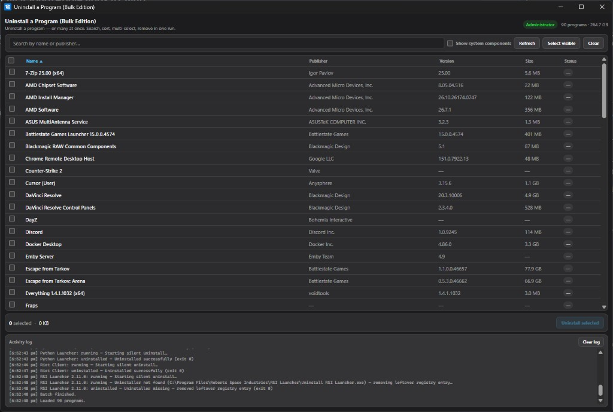

# Uninstall a Program (Bulk Edition)

**Uninstall a program** on Windows — or many at once. The bulk edition of a classic uninstall workflow: search, multi-select, and remove Win32/MSI apps in one run.

> Type **uninstall a program** in the Windows search bar → open **Uninstall a Program (Bulk Edition)**. Quiet MSI removal, admin-ready. Built with Tauri + Rust — not Electron bloat.

[](https://github.com/taylorivanoff/uninstall-a-program-bulk-edition/releases)
[](https://github.com/taylorivanoff/uninstall-a-program-bulk-edition/releases)


## Why Uninstall a Program (Bulk Edition)?

Windows Settings and Control Panel force you to remove apps **one at a time**. Power users, PC technicians, and anyone cleaning a machine need a way to **uninstall a program** — or **bulk uninstall** many — with:

- **List all installed programs** from the Windows Uninstall registry (64-bit + 32-bit)
- **Search, sort, and multi-select** apps by name, publisher, version, or size
- **Uninstall many programs in one run** — sequentially, with live status and a clear activity log
- Prefer **silent / quiet uninstall** when the vendor provides `QuietUninstallString`
- Fall back to **MSI** (`msiexec /x`) or the standard uninstall command
- **Protect** itself, system components, and common Microsoft runtimes from accidental removal
- Run with **administrator elevation** so machine-wide uninstalls actually work

If you searched for *uninstall a program*, *uninstall programs*, *bulk uninstall Windows*, or *remove multiple programs at once* — this is that tool.

## Features

| Feature | What you get |
|--------|----------------|
| **Bulk uninstall** | Select dozens of apps; remove them in one confirmed batch |
| **Fast program inventory** | Reads Uninstall registry keys — no slow WMI `Win32_Product` scans |
| **Search + sort** | Find apps quickly; sort by name, publisher, version, size, or status |
| **Quiet when possible** | Uses quiet uninstall strings and silent MSI flags first |
| **Safety rails** | Protected entries for this app, system components, KB updates, and common runtimes |
| **Live progress** | Per-app status (queued / running / uninstalled / failed) + exit codes in the log |
| **Lightweight native app** | Tauri 2 + Rust — small installer vs Electron-based utilities |
| **Shippable Windows build** | NSIS per-machine installer, Authenticode-ready |

## Screenshots



## Installation

1. Download the latest installer from [Releases](https://github.com/taylorivanoff/uninstall-a-program-bulk-edition/releases)
2. Run the setup exe and follow the prompts (WebView2 Runtime is used if already installed)

## Build from source

```bash
bun install
bun run build
```

Installer output:

`src-tauri/target/release/bundle/nsis/Uninstall a Program (Bulk Edition)_0.1.0_x64-setup.exe`

For signed public releases, see [SIGNING.md](SIGNING.md).

## GitHub Releases

Pushing source changes to `master` / `main` runs [`.github/workflows/release.yml`](.github/workflows/release.yml):

1. Detects changes under `src/`, `src-tauri/`, icons, or package files (README/docs/CI-only pushes are skipped)
2. Auto-bumps patch version across `package.json`, `tauri.conf.json`, and `Cargo.toml` when needed
3. Builds the Windows NSIS setup on `windows-latest` (checks out sibling [`tauri-tray-base`](https://github.com/taylorivanoff/tauri-tray-base))
4. Publishes the setup exe to a GitHub Release (`vX.Y.Z`)

Optional secret: `WINDOWS_CERTIFICATE_THUMBPRINT` for Authenticode signing in CI.

## How it works

1. Enumerates `HKLM` / `HKCU` Uninstall keys (including WOW6432Node for 32-bit apps on 64-bit Windows).
2. Shows DisplayName, publisher, version, and estimated size.
3. For each selected app, uninstall order is:
   1. `QuietUninstallString` (if present)
   2. MSI product code → `msiexec /x {GUID} /qn /norestart`
   3. `UninstallString` as registered by the vendor
4. Runs uninstallers **one after another** so installers do not fight over files or UIs.

## Develop

Requires Rust (MSVC), WebView2, and Bun/npm. Sibling crate [`tauri-tray-base`](https://github.com/taylorivanoff/tauri-tray-base) must sit at `../tauri-tray-base` relative to this repo (i.e. `Projects/tauri-tray-base`).

```bash
bun install
bun start      # or: bun run dev
bun run build
bun run release
bun run bump   # patch version across package.json / Cargo.toml / tauri.conf.json
```

Debug builds use `asInvoker` (no automatic UAC). For machine-wide uninstalls while developing, run the app as administrator. Release builds request elevation via `requireAdministrator`.

Close hides to the system tray (Quit from the tray menu). Tray **Refresh** reloads the program list.

## Compared to other options

| Approach | Bulk select | Quiet MSI | Native / light | Live log |
|----------|-------------|-----------|----------------|----------|
| Windows Settings | No | Partial | Built-in | No |
| Control Panel | No | Partial | Built-in | No |
| Manual `winget uninstall` | Scriptable | Varies | CLI | CLI |
| **Uninstall a Program (Bulk Edition)** | **Yes** | **Yes** | **Tauri + Rust** | **Yes** |

## Roadmap (not in v1 yet)

Honest scope so searchers know what ships today:

- Microsoft Store / UWP packages
- `winget` integration
- Leftover file / registry cleanup after uninstall
- Forced kill of locked processes before remove

## FAQ

**Is this a Windows batch uninstaller?**  
Yes — multi-select installed desktop programs and uninstall them in one confirmed run.

**Does it replace Revo / Bulk Crap Uninstaller?**  
It focuses on a clean, fast **bulk uninstall workflow** with a native footprint. Deep leftover scanning is on the roadmap, not v1.

**Will SmartScreen warn me?**  
Unsigned builds often will. Sign releases with Authenticode before distributing widely ([SIGNING.md](SIGNING.md)).

**Can it remove Microsoft Edge / Visual C++ runtimes?**  
Those entries are protected by default to avoid breaking Windows. Use “Show system components” only if you know what you are doing — protected items still cannot be selected for uninstall.

**Why this name?**  
People type **uninstall a program** into the Windows search bar. Starting with that phrase makes the app easy to find; **(Bulk Edition)** signals multi-select uninstall.

## Tech stack

- **Tauri 2** — Windows WebView2 shell
- **[tauri-tray-base](https://github.com/taylorivanoff/tauri-tray-base)** — tray, close-to-tray, settings, autostart, single-instance
- **Rust** — `winreg` enumeration, process spawn, elevation check
- **HTML / CSS / JS** — searchable, sortable multi-select UI

## Keywords

`uninstall a program` · `uninstall programs` · `windows uninstaller` · `bulk uninstall` · `uninstall multiple programs` · `batch remove software` · `windows program remover` · `msi quiet uninstall` · `pc cleanup` · `software uninstaller windows 11`

## License

Proprietary — all rights reserved unless otherwise stated by the author.
